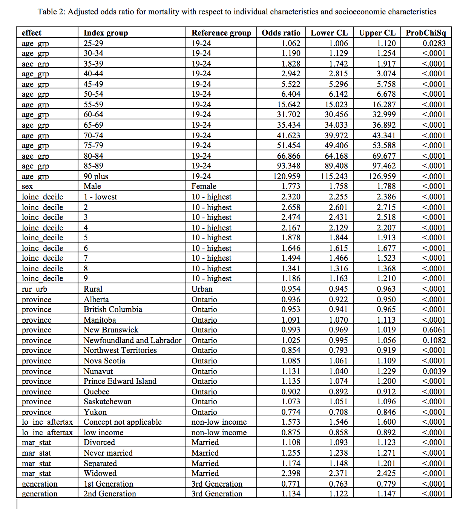

```{r setup, include=FALSE}
knitr::opts_chunk$set(echo = TRUE)
options(digits = 3)
```

# Intro

# Baseline Model


## Replicate in R

```{r baseline_glm-a}
library(tidyverse)
library(magrittr)
library(knitr)
library(feather)
library(speedglm)
library(broom)

clean_data <- read_feather(path="../assets/clean_data.feather")

# str(clean_data)

# baseline logistic model
# baseglm <- glm(dead ~ age_grp + sex + loinc_decile + rur_urb +
#                      province + lo_inc_aftertax + mar_stat + generation, 
#                      family=binomial, data=clean_data)
# 
# summary(baseglm)

baseglm <- speedglm(dead ~ age_grp + sex + loinc_decile + rur_urb +
                     province + lo_inc_aftertax + mar_stat + generation, 
                     family=binomial(), data=clean_data)

summary(baseglm)
```

```{r baseline_glm-b}

baseglm_df <- tidy(baseglm) %>%
              bind_cols(tibble(or=exp(coef(baseglm)))) %>%
              bind_cols(as.data.frame(exp(confint(baseglm)))) %>%
              rename(ci95_lower = "2.5 %", ci95_upper = "97.5 %")

kable(baseglm_df)
```

## SAS PROC LOGISTIC parameter estimates



